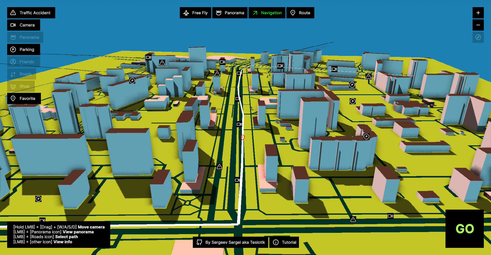
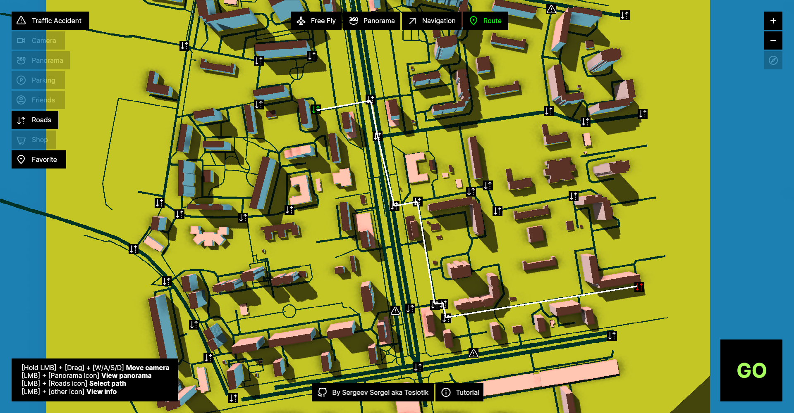
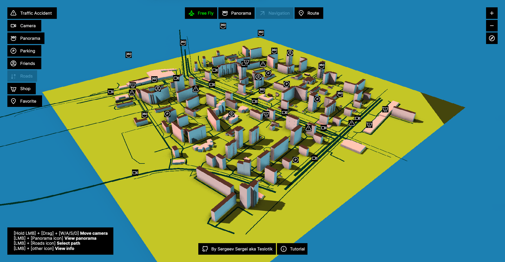

# Navigator Engine

Navigator Engine is a 3D viewer of the street. It supports different modes: flying across the map (`Free Fly`), predifined cameras view (`Panoramas`), `navigation` and path `routing`. Also you can enable or disable `layers`, `zoom` camera, align view to north (`compass`) and watch `tutorial`. In the future I will move navigator app into examples and separete it from the core, because it is already a game engine and a demo built on top of it. In the engine part a want to try a different approach - I use `tags` to organize hierarchy. Tags usage allows as to create parallel hierarchies such as animation, multithreading, physics, batch rendering and so on. To achive this I use `IWeakHierarchy` so child doesn't holds a reference to the parent and `IStrongHierarchy` so child holds a reference to the parent. This allows us to work with a specific types of children without filtering, also outline panel looks much cleaner, and user have more control of the engine's logic. You can also check my second engine called `Crovown`.

## Demo

You can switch between different modes to change camera and navigation behavior


## Screenshots







## Building

Tested with MSVC on Windows 10 and GCC on Fedora Linux

On Windows

```
  mkdir build
  cd build
  cmake ..
  msbuild engine.sln
```

On Linux

```bash
  mkdir build
  cd build
  cmake ..
  make
```